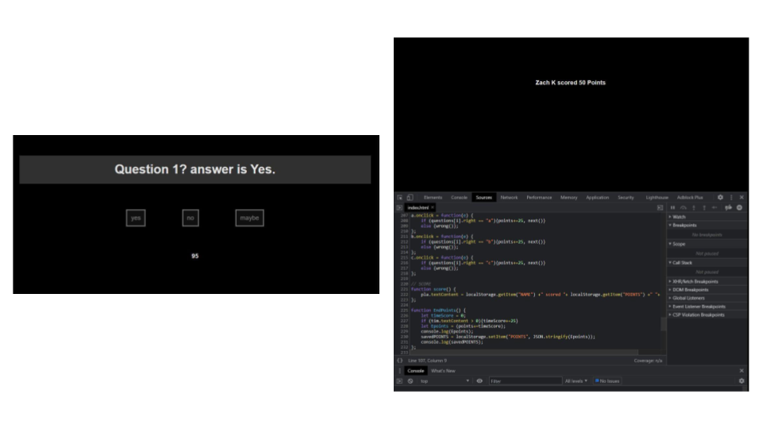

# Code-Quiz-ZK: JS Timed Quiz - 20210602


## Overview
Tasked to create a timed in browser quiz using Java Script. 

## Given Criteria
* Press a button to start the quiz.
* A new question is presented after the previous one is answered.
* A timer is shown and starts counting down when the quiz stars.
* Incorrect answers subtract time from the timer.
* When the timer reaches 0 the quiz ends.
* Name and score are stored.

## Design

The visual design is continuing the aesthetic I used in previous projects. Following the criteria the page opens to a button that will begin the Quiz.
Pressing the start button will prompt the user to enter their name before continuing on to the quiz.


After entering their name the quiz will begin by presenting the first question, answer options and a timer.
When the quiz is over or the timer has reached 0 the users name and score will be shown.

## Links
[REPOSITORY](link.com)
```
link.com
```

[DEPLOYED](link.com)
```
link.com
```
